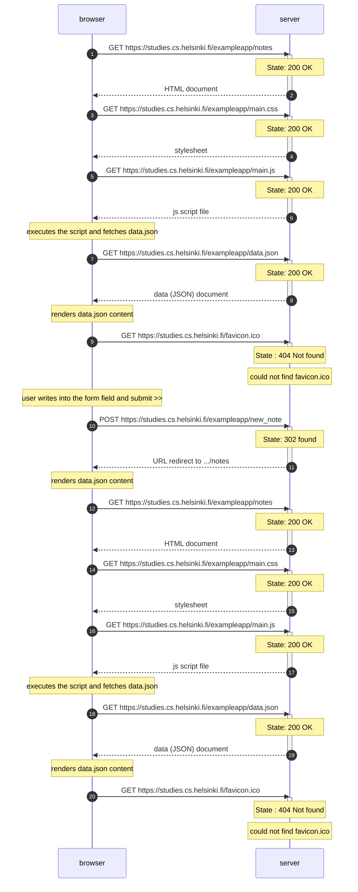

```mermaid
sequenceDiagram
    participant browser
    participant server

    autonumber

    browser->>server: GET https://studies.cs.helsinki.fi/exampleapp/notes
    activate server
    note over server: State: 200 OK
    server-->>browser: HTML document
    deactivate server

    browser->>server: GET https://studies.cs.helsinki.fi/exampleapp/main.css
    activate server
    note over server: State: 200 OK
    server -->> browser: stylesheet
    deactivate server

    browser->>server: GET https://studies.cs.helsinki.fi/exampleapp/main.js
    activate server
    note over server : State: 200 OK
    server-->> browser: js script file
    deactivate server
    note over browser : executes the script and fetches data.json

    browser->>server: GET https://studies.cs.helsinki.fi/exampleapp/data.json
    activate server
    note over server : State: 200 OK
    server-->> browser: data (JSON) document
    deactivate server
    note over browser : renders data.json content

     browser->>server: GET https://studies.cs.helsinki.fi/favicon.ico
    activate server
    note over server: State : 404 Not found 
    deactivate server
    note over server: could not find favicon.ico
    

    note over browser : user writes into the form field and submit >>

    browser->>server: POST https://studies.cs.helsinki.fi/exampleapp/new_note
    activate server
    note over server : State: 302 found
    server-->> browser: URL redirect to .../notes
    deactivate server
    note over browser : renders data.json content

    browser->>server: GET https://studies.cs.helsinki.fi/exampleapp/notes
    activate server
    note over server: State: 200 OK
    server-->>browser: HTML document
    deactivate server

    browser->>server: GET https://studies.cs.helsinki.fi/exampleapp/main.css
    activate server
    note over server: State: 200 OK
    server -->> browser: stylesheet
    deactivate server

    browser->>server: GET https://studies.cs.helsinki.fi/exampleapp/main.js
    activate server
    note over server : State: 200 OK
    server-->> browser: js script file
    deactivate server
    note over browser : executes the script and fetches data.json

    browser->>server: GET https://studies.cs.helsinki.fi/exampleapp/data.json
    activate server
    note over server : State: 200 OK
    server-->> browser: data (JSON) document
    deactivate server
    note over browser : renders data.json content

     browser->>server: GET https://studies.cs.helsinki.fi/favicon.ico
    activate server
    note over server: State : 404 Not found 
    deactivate server
    note over server: could not find favicon.ico
```